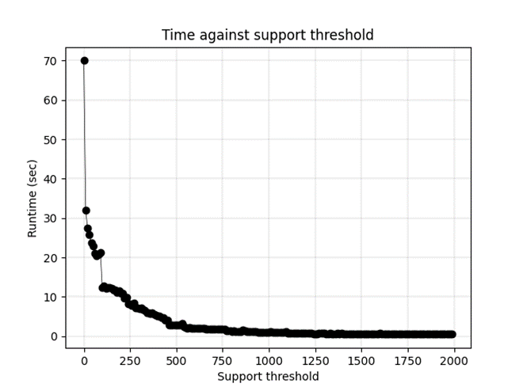

## Getting Started

### Execution
Run the program with dataset provided and **default** values for *minSupport* = 50 and *minConfidence* = 0.5

```
python apriori.py -f ../dataset/data3.csv
```
Run program with dataset and min support and min confidence  

```
python apriori.py  -f ../dataset/data3.csv -s 60

```
### Example dataset3.csv

<p align=center>
    
</p>

<p align=center>
    
</p>

## Concepts of Apriori

* **Support:** Fraction of transactions that contain an itemset
* **Confidence:** Measures how often items in Y appear in transactions that contain X
* **Frequent itemset:** An itemset whose support is greater than or equal to a minSup threshold
